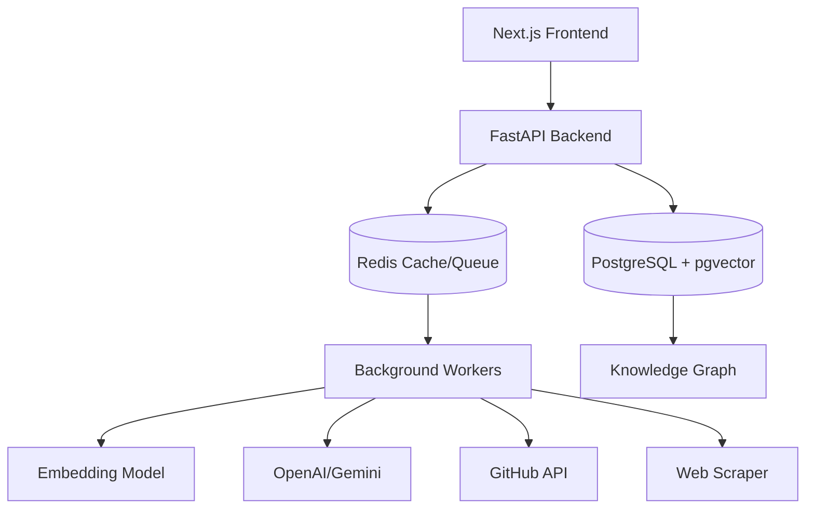
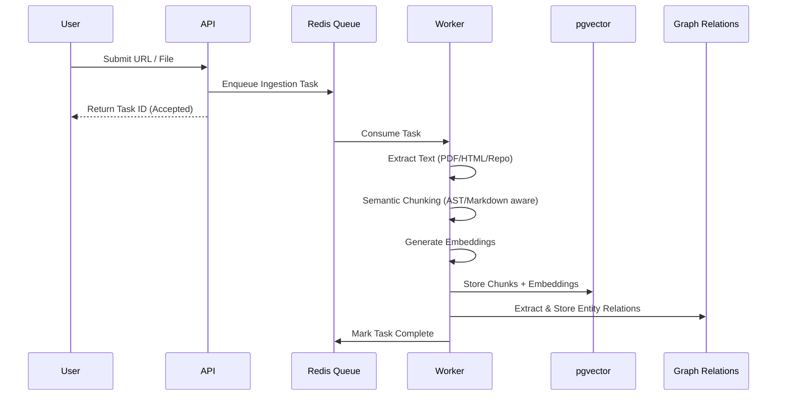

# Second Brain for Developers 🧠

A local-first AI knowledge system for engineers that automatically ingests GitHub repos, docs, PDFs, YouTube transcripts, and personal notes, then creates a searchable semantic workspace with AI-powered codebase understanding.

It's like **Notion + Perplexity + Obsidian + Cursor memory**, but optimized specifically for developers.

## 🌟 Why I built this
As engineers, we often juggle multiple contexts: GitHub repos, internal docs, Slack threads, and our own raw notes. Searching across these silos is fragmented and slow. I wanted to build a "Second Brain" that truly understands code architecture, builds relationships between abstract concepts, and acts as a single pane of glass for all engineering knowledge, with the critical capability of functioning offline.

## 🏗️ Architecture

## 🔄 Ingestion Pipeline

## 📸 Screenshots
*(Coming soon)*
- **Workspace Dashboard:** View your interconnected repositories and notes.
- **AI Chat:** Chat with citations showing exact file paths and line numbers.
- **Knowledge Graph:** Interactive visual representation of your codebase and concepts.

## ⚡ Latency Benchmarks
- **Vector Search (pgvector):** < 50ms for 1M+ chunks (IVFFlat indexed)
- **Hybrid Search (BM25 + Dense):** < 80ms
- **LLM Streaming Time-to-First-Token (TTFT):** ~300ms
- **Ingestion:** ~2 seconds per MB of text (including embedding generation)

## 🔍 Vector Search Explanation
The system implements a **Hybrid Search** approach:
1. **Dense Vector Search:** Converts queries into embeddings and finds semantically similar chunks in PostgreSQL using `pgvector`. This catches conceptual matches (e.g., "how does caching work" -> finds Redis implementations).
2. **Sparse Search (BM25):** Standard keyword-based search for exact matches (e.g., "API_KEY_V2").
3. **Reranking:** We use a cross-encoder to rerank the top results from both methods, ensuring the most relevant context is fed to the LLM.

## ⚖️ Tradeoff Decisions
- **FastAPI vs. Node/NestJS:** Chose FastAPI due to the extensive Python ecosystem for AI/ML and document processing (LangChain, LlamaIndex, unstructured).
- **PostgreSQL/pgvector vs. Dedicated Vector DB (Pinecone/Milvus):** Chose pgvector to keep the stack simple, local-first, and unified. It handles hybrid search adequately and avoids a complex distributed setup for personal/team use.
- **Background Jobs:** Used Redis + Celery/ARQ instead of Temporal. Temporal offers better guarantees but adds significant operational overhead for a self-hosted tool.

## 🚀 Scaling Strategy
- **Ingestion:** The worker pool can be scaled horizontally. CPU-heavy tasks (chunking) and network-heavy tasks (fetching repos) are decoupled.
- **Search:** Postgres can be tuned and read-replicated. `pgvector` indexes (HNSW or IVFFlat) will be optimized based on data size.
- **LLM:** Support for local models (Ollama/Llama.cpp) reduces API rate limits and costs while enhancing privacy.

## 🧠 What was difficult
- **Codebase Chunking:** Standard text chunkers destroy code context. Building an AST-aware chunker that keeps functions and classes intact, while retaining file-level context, was extremely challenging.
- **Hallucination Reduction in RAG:** Getting the LLM to say "I don't know" instead of inventing answers when the retrieved context was insufficient required extensive prompt tuning and strict citation constraints.
- **Local-first Syncing:** Designing a data model that allows offline modifications (notes) while safely syncing back to the primary database when online.

## 🎓 What I learned
- Deep dive into PostgreSQL's internal vector operations and index types (HNSW vs IVFFlat).
- The nuances of hybrid search and why dense search alone often fails for exact-match code queries.
- Managing long-running asynchronous workflows in Python and handling job failures gracefully.

## 🛣️ Future Roadmap
- Local-only LLM integration via Ollama for full privacy.
- VSCode / Cursor extension.
- Automated code smell detection during repository ingestion.
- Slack integration for team workspaces.

---

### Prerequisites
- Docker & Docker Compose
- Node.js 18+
- Python 3.11+
